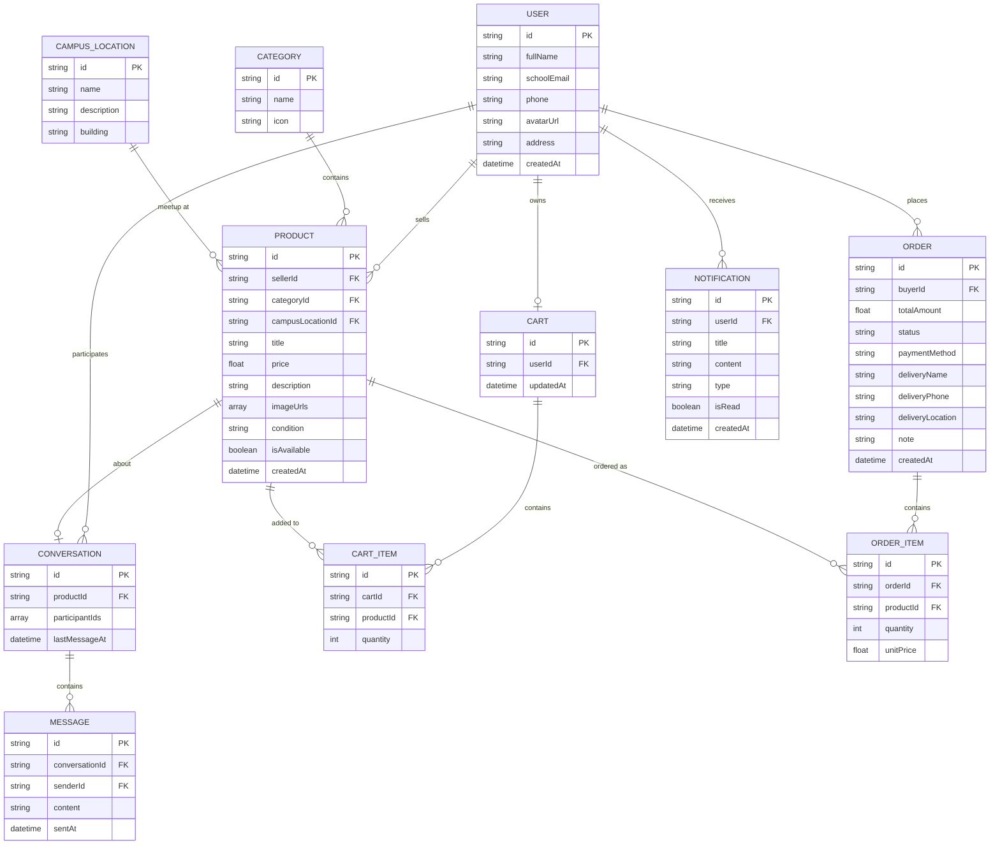
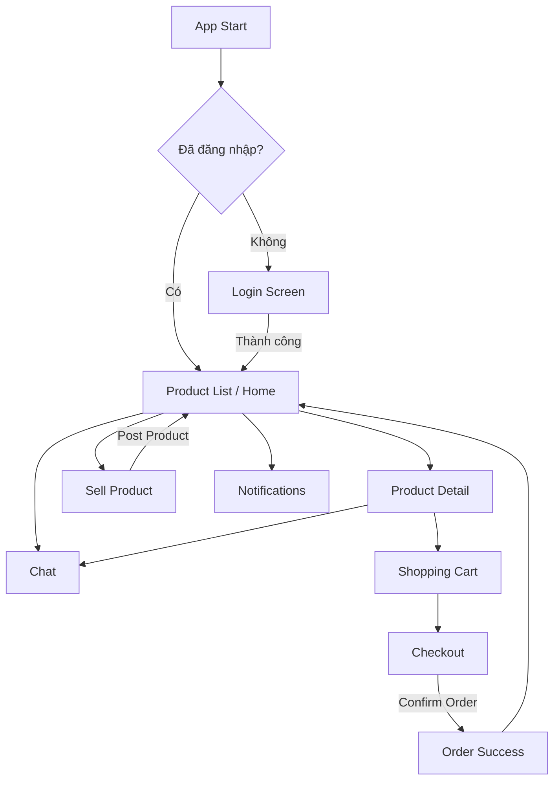

# Student Marketplace — Tổng quan dự án

Ứng dụng mua bán đồ dành cho sinh viên, xây dựng bằng **Flutter**. Tài liệu này mô tả cấu trúc dữ liệu, các màn hình chính, luồng xử lý và yêu cầu đánh giá cho toàn bộ dự án.

**Công nghệ backend (chọn một):** Firebase Firestore, SQLite, hoặc REST API.

---

## Mục lục

1. [Design Database / API Structure](#1-design-database--api-structure)
2. [Login Screen](#2-login-screen)
3. [Product List Screen](#3-product-list-screen)
4. [Product Detail Screen](#4-product-detail-screen)
5. [Shopping Cart Screen](#5-shopping-cart-screen)
6. [Checkout / Billing Screen](#6-checkout--billing-screen)
7. [Create Product Listing / Sell Product Screen](#7-create-product-listing--sell-product-screen)
8. [Notifications Screen](#8-notifications-screen)
9. [Messaging / Chat Screen](#9-messaging--chat-screen)
10. [Apply State Management: Provider / Bloc](#10-apply-state-management-provider--bloc)

---

## 1. Design Database / API Structure

Thiết kế cấu trúc dữ liệu hoặc API phục vụ toàn bộ ứng dụng.

### 1.1. Các nhóm dữ liệu chính

| Nhóm dữ liệu | Mô tả |
|---|---|
| **User / Student** | Thông tin tài khoản sinh viên: họ tên, email trường học, số điện thoại, avatar, địa chỉ, mật khẩu hoặc Firebase Auth |
| **Product** | Sản phẩm sinh viên đăng bán: tên, giá, mô tả, hình ảnh, tình trạng, danh mục, trạng thái còn bán |
| **Category** | Danh mục: sách, đồ điện tử, phụ kiện, quần áo, đồ học tập |
| **Cart** | Sản phẩm người dùng thêm vào giỏ hàng |
| **Order** | Đơn hàng: người mua, sản phẩm, tổng tiền, trạng thái |
| **Notification** | Thông báo khuyến mãi, xác nhận đơn hàng, thông báo hệ thống |
| **Campus Location** | Vị trí gặp mặt / khu vực giao dịch trong trường |
| **Message / Chat** | Nội dung trò chuyện giữa người mua và người bán |

### 1.2. Mô hình ERD



### 1.3. Quan hệ giữa các bảng / collection

| Quan hệ | Mô tả |
|---|---|
| User → Product | Một sinh viên có thể đăng nhiều sản phẩm (1-N) |
| Category → Product | Một danh mục chứa nhiều sản phẩm (1-N) |
| User → Cart → CartItem → Product | Mỗi user có một giỏ hàng chứa nhiều sản phẩm |
| User → Order → OrderItem → Product | Người mua tạo đơn hàng gồm nhiều sản phẩm |
| User → Notification | Mỗi user nhận nhiều thông báo |
| Product → Campus Location | Sản phẩm gắn địa điểm giao dịch trong trường |
| Conversation → Message | Cuộc hội thoại giữa buyer/seller chứa nhiều tin nhắn |
| Product → Conversation | Chat thường gắn với một sản phẩm cụ thể |

### 1.4. Firestore Collections (gợi ý)

```
users/{userId}
categories/{categoryId}
products/{productId}
carts/{userId}/items/{itemId}
orders/{orderId}
notifications/{notificationId}
campus_locations/{locationId}
conversations/{conversationId}
  └── messages/{messageId}
```

### 1.5. REST API Endpoints (nếu dùng REST API)

| Method | Endpoint | Mô tả |
|---|---|---|
| POST | `/auth/login` | Đăng nhập |
| POST | `/auth/register` | Đăng ký |
| GET | `/products` | Danh sách sản phẩm (search, filter) |
| GET | `/products/:id` | Chi tiết sản phẩm |
| POST | `/products` | Tạo sản phẩm mới |
| PUT | `/products/:id` | Cập nhật sản phẩm |
| DELETE | `/products/:id` | Xóa sản phẩm |
| GET | `/categories` | Danh sách danh mục |
| GET | `/cart` | Lấy giỏ hàng của user |
| POST | `/cart/items` | Thêm sản phẩm vào giỏ |
| PUT | `/cart/items/:id` | Cập nhật số lượng |
| DELETE | `/cart/items/:id` | Xóa khỏi giỏ |
| POST | `/orders` | Tạo đơn hàng |
| GET | `/orders` | Danh sách đơn hàng |
| GET | `/orders/:id` | Chi tiết đơn hàng |
| GET | `/notifications` | Danh sách thông báo |
| PATCH | `/notifications/:id/read` | Đánh dấu đã đọc |
| GET | `/conversations` | Danh sách hội thoại |
| GET | `/conversations/:id/messages` | Lịch sử chat |
| POST | `/conversations/:id/messages` | Gửi tin nhắn |
| GET | `/campus-locations` | Danh sách địa điểm giao dịch |

### 1.6. CRUD dữ liệu

| Entity | Create | Read | Update | Delete |
|---|---|---|---|---|
| User | Register | Profile, Login | Edit profile | — |
| Product | Sell Product screen | Product List, Detail | Edit listing | Xóa bài đăng |
| Category | Seed data / Admin | Filter, Sell form | Admin | — |
| Cart | Add to Cart | Cart screen | Tăng/giảm số lượng | Xóa item |
| Order | Checkout | Order history | Cập nhật trạng thái | — |
| Notification | Hệ thống tự tạo | Notifications screen | Mark as read | — |
| Message | Chat screen | Chat history | — | — |

### 1.7. Dữ liệu sử dụng ở màn hình nào

| Màn hình | Dữ liệu sử dụng |
|---|---|
| Login | User (auth) |
| Product List | Product, Category, User (seller) |
| Product Detail | Product, User (seller), Category |
| Shopping Cart | Cart, CartItem, Product |
| Checkout | Cart, Order, Campus Location |
| Sell Product | Product, Category, Campus Location, User |
| Notifications | Notification |
| Chat | Conversation, Message, User, Product |

---

## 2. Login Screen

Cho phép sinh viên đăng nhập để sử dụng các chức năng cá nhân: đăng sản phẩm, nhắn tin, mua hàng, quản lý đơn hàng.

### Mục đích

Đảm bảo chỉ người dùng đã có tài khoản mới sử dụng được ứng dụng.

### Mô tả xử lý

1. Khi mở ứng dụng, nếu chưa đăng nhập → hiển thị màn hình **Login**.
2. Người dùng nhập:
   - Email hoặc số điện thoại
   - Mật khẩu
3. Ứng dụng kiểm tra:
   - Đã nhập đủ thông tin chưa
   - Email đúng định dạng chưa
   - Tài khoản có tồn tại không
   - Mật khẩu có chính xác không
4. **Hợp lệ** → chuyển sang màn hình **Home / Product List**
5. **Không hợp lệ** → hiển thị lỗi: *"Email hoặc mật khẩu không đúng"*

### Input / Output

| | Nội dung |
|---|---|
| **Input** | Email/số điện thoại, Mật khẩu |
| **Output** | Đăng nhập thành công **hoặc** hiển thị lỗi |

### Yêu cầu đánh giá

- [ ] Có validate dữ liệu
- [ ] Có hiển thị lỗi
- [ ] Có lưu trạng thái đăng nhập
- [ ] Có giao diện rõ ràng

---

## 3. Product List Screen

Hiển thị danh sách sản phẩm sinh viên đang đăng bán.

### Mục đích

Giúp người dùng tìm kiếm và xem các sản phẩm trong cộng đồng sinh viên.

### Mô tả xử lý

- Lấy dữ liệu từ Firebase/API, hiển thị dạng **danh sách** hoặc **grid view**.
- Mỗi sản phẩm hiển thị: hình ảnh, tên, giá, danh mục, tình trạng, người bán.
- Người dùng có thể:
  - Cuộn để xem thêm
  - Tìm kiếm theo tên
  - Lọc theo danh mục
  - Lọc theo khoảng giá
  - Lọc theo trạng thái còn bán
- Chọn sản phẩm → chuyển sang **Product Detail**

### Input / Output

| | Nội dung |
|---|---|
| **Input** | Danh sách sản phẩm, từ khóa tìm kiếm, điều kiện lọc |
| **Output** | Danh sách sản phẩm, kết quả tìm kiếm/lọc, điều hướng sang chi tiết |

### Yêu cầu đánh giá

- [ ] Hiển thị dữ liệu thật
- [ ] Có loading
- [ ] Có xử lý empty state
- [ ] Có search/filter

---

## 4. Product Detail Screen

Hiển thị thông tin chi tiết sản phẩm.

### Mục đích

Giúp người dùng hiểu rõ sản phẩm trước khi mua hoặc liên hệ người bán.

### Mô tả xử lý

Hiển thị:
- Hình ảnh
- Tên sản phẩm
- Giá bán
- Mô tả
- Tình trạng: **Mới** / **Đã sử dụng**
- Thông tin người bán
- Thời gian đăng bài
- Trạng thái còn bán / hết hàng

Người dùng có thể:
- **Add to Cart**
- Nhắn tin người bán
- Lưu yêu thích
- Nếu sản phẩm đã bán → **disable** nút mua

### Input / Output

| | Nội dung |
|---|---|
| **Input** | ID sản phẩm, số lượng muốn mua |
| **Output** | Hiển thị chi tiết, thêm vào giỏ hàng, thông báo |

### Yêu cầu đánh giá

- [ ] Có đầy đủ thông tin
- [ ] Có xử lý còn hàng/hết hàng
- [ ] Có cập nhật giỏ hàng

---

## 5. Shopping Cart Screen

Quản lý các sản phẩm đã thêm vào giỏ hàng.

### Mục đích

Giúp người dùng kiểm tra lại sản phẩm trước khi đặt hàng.

### Mô tả xử lý

Hiển thị: hình ảnh, tên, giá, số lượng, thành tiền.

Người dùng có thể:
- Tăng/giảm số lượng
- Xóa sản phẩm
- Xem tổng tiền
- Chuyển sang **Checkout**

Giỏ hàng rỗng → hiển thị *"Your cart is empty"*.

### Input / Output

| | Nội dung |
|---|---|
| **Input** | Danh sách sản phẩm trong cart, thao tác cập nhật số lượng |
| **Output** | Giỏ hàng cập nhật, tổng tiền thay đổi, chuyển sang Checkout |

### Yêu cầu đánh giá

- [ ] Có cập nhật realtime
- [ ] Có tính tổng tiền
- [ ] Có xử lý cart rỗng

---

## 6. Checkout / Billing Screen

Xác nhận và hoàn tất đơn hàng.

### Mục đích

Hoàn tất quá trình mua hàng.

### Mô tả xử lý

**Hiển thị:**
- Danh sách sản phẩm
- Tổng tiền
- Thông tin giao nhận

**Người dùng nhập:**
- Họ tên
- Số điện thoại
- Địa điểm gặp mặt / giao hàng
- Ghi chú

**Phương thức thanh toán:**
- Tiền mặt
- Chuyển khoản demo

**Sau khi Confirm Order:**
1. Tạo đơn hàng
2. Lưu database
3. Xóa giỏ hàng
4. Hiển thị thành công

### Input / Output

| | Nội dung |
|---|---|
| **Input** | Sản phẩm trong giỏ, thông tin nhận hàng |
| **Output** | Đơn hàng mới, cart được xóa, thông báo thành công |

### Yêu cầu đánh giá

- [ ] Có validate thông tin
- [ ] Có tạo order
- [ ] Có cập nhật trạng thái đơn hàng

---

## 7. Create Product Listing / Sell Product Screen

Cho phép sinh viên đăng bài rao bán sản phẩm.

### Mục đích

Giúp sinh viên dễ dàng đăng bán: sách cũ, laptop, điện thoại, phụ kiện, quần áo, đồ học tập.

### Mô tả xử lý

Mở bằng nút **"+"** ở giữa thanh điều hướng → hiển thị form đăng bài.

**Người dùng nhập:**
- Hình ảnh sản phẩm (nhiều ảnh)
- Tên sản phẩm
- Giá bán
- Danh mục sản phẩm
- Tình trạng: **New** / **Like New** / **Used**
- Mô tả sản phẩm
- Địa điểm giao dịch
- Số điện thoại liên hệ

**Sau khi bấm "Post Product":**
1. Kiểm tra dữ liệu hợp lệ
2. Upload ảnh lên Firebase Storage / API
3. Lưu sản phẩm vào database
4. Thông báo thành công → quay về Product List

Dữ liệu thiếu → hiển thị lỗi tương ứng.

### Input / Output

| | Nội dung |
|---|---|
| **Input** | Hình ảnh, tên, giá, mô tả, danh mục, thông tin liên hệ |
| **Output** | Bài đăng mới, dữ liệu lưu DB/API, thông báo thành công hoặc lỗi |

### Yêu cầu đánh giá

- [ ] Có upload hình ảnh
- [ ] Có validate dữ liệu nhập
- [ ] Có lưu dữ liệu thật vào database/API
- [ ] Có hiển thị loading khi upload
- [ ] Có xử lý lỗi upload
- [ ] Có tạo sản phẩm mới thành công
- [ ] Có cập nhật danh sách sản phẩm sau khi đăng bài
- [ ] Có giao diện rõ ràng, dễ sử dụng

---

## 8. Notifications Screen

Hiển thị thông báo cho người dùng.

### Mục đích

Giúp người dùng nhận thông tin mới.

### Mô tả xử lý

**Loại thông báo:**
- Đơn hàng đã xác nhận
- Có tin nhắn mới
- Khuyến mãi
- Sản phẩm mới

**Mỗi thông báo gồm:** tiêu đề, nội dung, thời gian, trạng thái đã đọc/chưa đọc.

Người dùng có thể: xem chi tiết, đánh dấu đã đọc.

### Input / Output

| | Nội dung |
|---|---|
| **Input** | Danh sách notification |
| **Output** | Danh sách thông báo, điều hướng liên quan |

### Yêu cầu đánh giá

- [ ] Có phân biệt read/unread
- [ ] Có xử lý không có dữ liệu

---

## 9. Messaging / Chat Screen

Cho phép người mua và người bán nhắn tin với nhau.

### Mục đích

Hỗ trợ trao đổi nhanh về sản phẩm.

### Mô tả xử lý

Người dùng có thể: gửi tin nhắn, xem lịch sử chat, nhận phản hồi.

**Mỗi tin nhắn gồm:** nội dung, người gửi, thời gian gửi.

**Ví dụ:**
- *"Sản phẩm còn không?"*
- *"Có thể giảm giá không?"*
- *"Hẹn giao ở thư viện nhé."*

### Input / Output

| | Nội dung |
|---|---|
| **Input** | Nội dung tin nhắn |
| **Output** | Tin nhắn hiển thị, tin nhắn lưu database |

### Yêu cầu đánh giá

- [ ] Có giao diện chat
- [ ] Có lịch sử chat
- [ ] Có phân biệt sender/receiver

---

## 10. Apply State Management: Provider / Bloc

Sử dụng state management để quản lý trạng thái ứng dụng.

### Mục đích

Giúp ứng dụng ổn định, dễ bảo trì, dữ liệu đồng bộ giữa các màn hình.

### Các state chính

| State | Mô tả |
|---|---|
| **Authentication State** | Quản lý login/logout |
| **Product State** | Danh sách sản phẩm |
| **Cart State** | Giỏ hàng |
| **Order State** | Đơn hàng |
| **Notification State** | Thông báo |
| **Chat State** | Tin nhắn |

### Ví dụ luồng

Khi **Add to Cart**:
1. `CartProvider` (hoặc `CartBloc`) cập nhật dữ liệu
2. Badge số lượng cart cập nhật ngay trên UI

### Input / Output

| | Nội dung |
|---|---|
| **Input** | User actions, API/database data |
| **Output** | UI cập nhật realtime, loading/error/success state |

### Yêu cầu đánh giá

- [ ] Có dùng Provider/Bloc rõ ràng
- [ ] Có tách logic khỏi UI
- [ ] Có cập nhật UI theo state

---

## Sơ đồ điều hướng màn hình (gợi ý)



---

## Cấu trúc thư mục gợi ý (Flutter)

```
lib/
├── main.dart
├── models/          # User, Product, Order, Cart, ...
├── providers/       # hoặc blocs/
├── services/        # API, Firebase, Auth
├── screens/
│   ├── auth/
│   ├── home/
│   ├── product/
│   ├── cart/
│   ├── checkout/
│   ├── sell/
│   ├── notifications/
│   └── chat/
└── widgets/         # Component dùng chung
```
